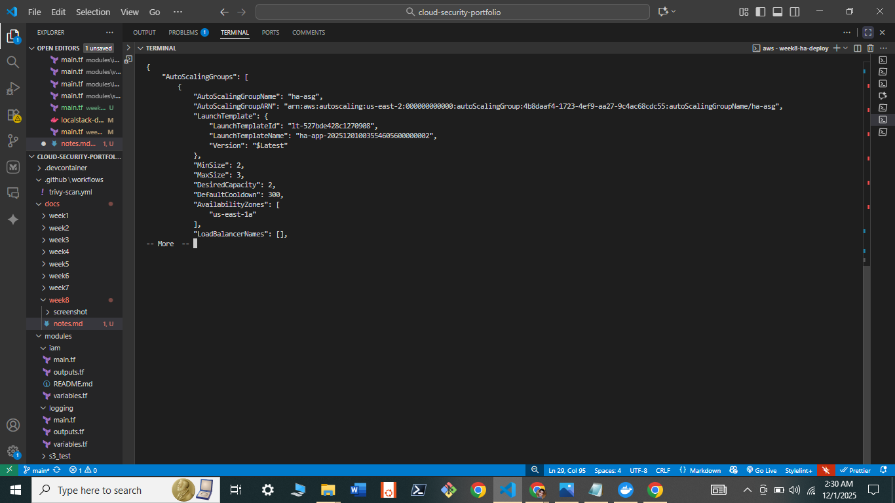
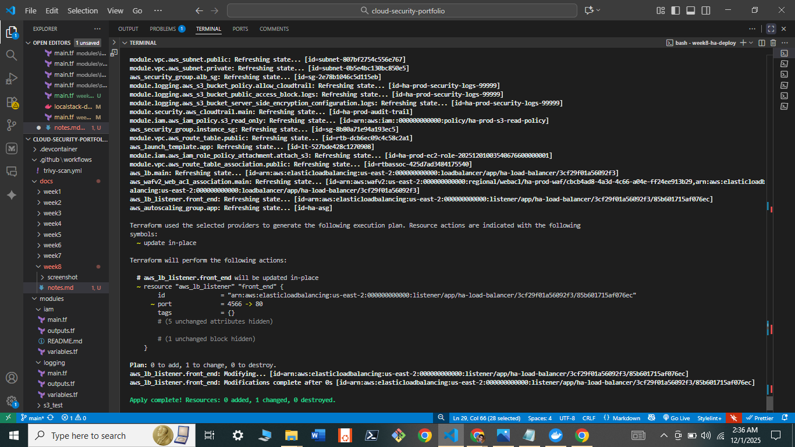

# 🔄 High-Availability AWS Architecture & Auto-Scaling Infrastructure

<div align="center">


**Multi-AZ | WAF + GuardDuty | Auto-Scaling EC2 Fleet | CloudTrail Audit**

</div>

---

## 🎯 Project Mission

Transform a single-server architecture into a **self-healing, fault-tolerant fleet** protected by multi-layer security — demonstrating the AWS Well-Architected Framework's Reliability and Security pillars using Infrastructure as Code.

---

## 1. Architecture

```
Internet
    │
    ▼ HTTP (port 80) → Permanent 301 redirect to HTTPS
┌───────────────────────────────────────────────────────┐
│              WAFv2 Web ACL                            │
│   Rule 1: AWSManagedRulesCommonRuleSet (SQLi, XSS)   │
│   Rule 2: AWSManagedRulesKnownBadInputsRuleSet        │
│           (Log4Shell, Spring4Shell, etc.)              │
└────────────────────────┬──────────────────────────────┘
                         │ Clean traffic only
    ┌────────────────────▼────────────────────┐
    │        Application Load Balancer         │
    │     (Internet-facing, drop_invalid_headers=true)
    │  ┌─────────────────┬─────────────────┐  │
    │  │  AZ us-east-2a  │  AZ us-east-2b  │  │  ← True Multi-AZ
    │  │  Public Subnet  │  Public Subnet  │  │
    │  └────────┬────────┴────────┬────────┘  │
    └───────────┼─────────────────┼───────────┘
                │  SG: port 80 from ALB only
    ┌───────────▼─────────────────▼───────────┐
    │       Auto Scaling Group (min=2, max=6)  │
    │  ┌──────────────┐  ┌──────────────┐     │
    │  │  EC2 Worker  │  │  EC2 Worker  │     │  ← Private subnets
    │  │ (IMDSv2 req) │  │ (encrypted   │     │    behind NAT GW
    │  │ (gp3 EBS enc)│  │  EBS)        │     │
    │  └──────────────┘  └──────────────┘     │
    └─────────────────────────────────────────┘

Supporting services:
  CloudTrail → S3 (KMS encrypted) ← audit log of all API calls
  GuardDuty  → findings every 15 min ← ML threat detection
  ALB Logs   → S3 ← request-level access log
```

---

## 2. Security Controls Implemented

| Layer | Control | Standard |
| :--- | :--- | :--- |
| **Edge (L7)** | WAFv2 Managed Rules (Common + Known Bad Inputs) | OWASP Top 10 |
| **ALB** | `drop_invalid_header_fields = true` | HTTP header injection prevention |
| **ALB** | HTTP→HTTPS permanent redirect (301) | TLS enforcement |
| **EC2** | IMDSv2 required (`http_tokens = required`, hop limit = 1) | SSRF mitigation |
| **EC2** | EBS encryption at rest (gp3, AES-256) | CIS AWS Benchmark 2.2.1 |
| **EC2** | No public IP (private subnets) | Reduce attack surface |
| **EC2** | IAM least-privilege role (S3 read-only to log bucket) | Principle of Least Privilege |
| **Network** | Instances only reachable from ALB SG | Zero direct internet access |
| **Audit** | CloudTrail multi-region with log file validation | SOC2 / CIS L1 |
| **Threat Detection** | GuardDuty (15-min publishing) | ML-based anomaly detection |
| **Logs** | ALB access logs → S3 | Security forensics |

---

## 3. High Availability Design

### Why Multi-AZ is Critical

An availability zone (AZ) is a discrete data centre with independent power, networking, and cooling. If a single AZ fails:
- Single-AZ ALB: **100% outage**
- Multi-AZ ALB: **0% impact** — traffic shifts to healthy AZ automatically

This project spans **two AZs** (`us-east-2a`, `us-east-2b`) — the minimum for a production HA deployment.

### Auto Scaling Policies

| Policy | Trigger | Action |
| :--- | :--- | :--- |
| **CPU Target Tracking** | Average CPU > 70% | Scale out automatically |
| **ALB Request Count** | > 1000 requests/target/min | Scale out automatically |
| **Scale-in Cooldown** | 300 seconds | Prevent oscillation |
| **Minimum Capacity** | 2 instances | Ensure HA even at zero traffic |

---

## 4. Module Architecture

```
ha-aws-architecture/
└── main.tf                 (Composes all modules)
    ├── ../modules/logging   → S3 bucket (KMS, versioning, TLS-only, lifecycle)
    ├── ../modules/security  → CloudTrail + GuardDuty
    ├── ../modules/vpc       → Multi-AZ VPC (public + private subnets, NAT GW)
    └── ../modules/iam       → EC2 instance profile (least-privilege S3 access)
```

---

## 5. Engineering Challenges Solved

| Challenge | Root Cause | Solution Applied |
| :--- | :--- | :--- |
| **Provider Conflict** | Terraform v5.x incompatibility with LocalStack S3 API | Pinned to `v4.67.0` — documented in `.terraform.lock.hcl` |
| **Single-AZ ALB** | ALB requires ≥ 2 subnets in different AZs | Added second public subnet (AZ-b) via VPC module update |
| **HTTP-only traffic** | No TLS termination | Added HTTP→HTTPS 301 redirect listener |
| **SSRF via IMDS** | IMDSv1 allows credential theft from within container | `http_tokens = "required"`, hop limit = 1 |

---

## 6. Deployment

### Prerequisites
- Docker Desktop with LocalStack Pro running (`docker-compose up -d` from `finops/`)
- Terraform ≥ 1.5.0

```bash
cd ha-aws-architecture

# Initialise and validate
terraform init
terraform validate

# Preview changes
terraform plan

# Deploy
terraform apply -auto-approve

# Verify outputs
terraform output
```

### Expected Outputs

```
alb_dns_name = "ha-load-balancer-xxxx.us-east-2.elb.amazonaws.com"
asg_name     = "ha-asg"
vpc_id       = "vpc-xxxx"
waf_arn      = "arn:aws:wafv2:..."
```

---

## 7. Evidence

<p align="center">
  
  <br><em>Auto Scaling Group with min=2 capacity confirmed</em>
</p>

<p align="center">
  
  <br><em>Full stack deployed: WAF + ALB + ASG + CloudTrail + GuardDuty</em>
</p>

---

**Author:** Jimoh Sodiq Bolaji  
**Architecture Decision Records:** [ADR-001](../docs/adr/ADR-001-localstack-over-real-aws.md) | [ADR-002](../docs/adr/ADR-002-terraform-remote-state.md)
