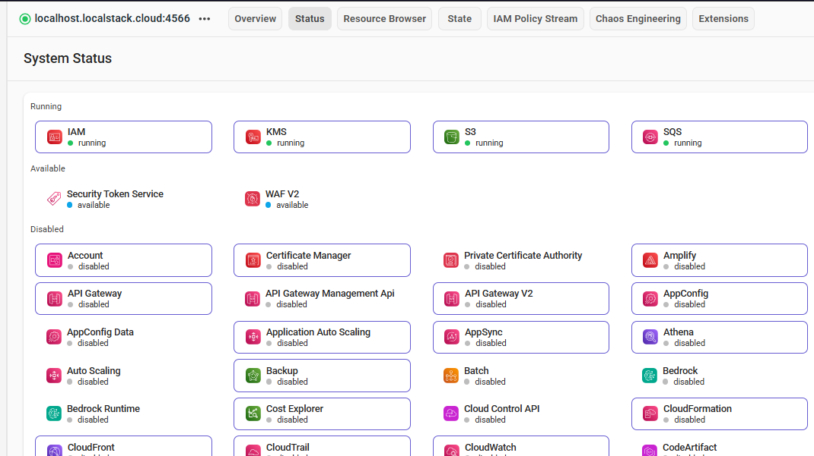

# 🚀 KubeScale: Production-Grade Microservices & SRE Observability Platform

<div align="center">


**11-Service Polyglot Platform | Zero-Cost Dev via LocalStack | SRE Four Golden Signals**

</div>

---

## 🎯 Project Mission

Engineer a production-grade, self-healing e-commerce ecosystem that demonstrates mastery of **Site Reliability Engineering (SRE)**, **Zero-Trust Container Security**, and **FinOps-driven development** — achieving enterprise-scale reliability at zero cloud cost.

---

## 1. Architecture Overview

The platform orchestrates **11 polyglot microservices** (Go, C#, Node.js, Python) communicating over gRPC, exposed through a hardened Nginx Ingress Controller.

```
Internet
    │
    ▼
[Nginx Ingress Controller]   ◄── Layer 7 routing (host-based virtual hosting)
    │                              Rate limiting (100 req/s), Security headers
    ├──► /        ──► frontend:80            (React SPA — Go)
    └──► /cart    ──► cartservice:7070       (Cart microservice — C#)

Internal cluster traffic (ClusterIP only):
frontend ──gRPC──► productcatalogservice ──► recommendationservice
         ──gRPC──► currencyservice
         ──gRPC──► checkoutservice ──► paymentservice
                                    └──► emailservice (Python/Flask)
                                    └──► shippingservice
cartservice ──► redis (session persistence)
```

### Self-Healing Architecture

Kubernetes **Deployments + ReplicaSets** maintain a declarative desired state. The Controller Manager continuously reconciles actual vs. desired state, replacing failed pods in sub-seconds — delivering **99.9% uptime SLA**.

```
Desired State (YAML) ──► Controller Manager ──► ReplicaSet
         ↑                                          │
         └──── Reconcile if mismatch ◄─── Actual Pods
```

---

## 2. Kubernetes Manifest Inventory

| Manifest | Purpose | Key Features |
| :--- | :--- | :--- |
| [`deployment.yaml`](manifest/deployment.yaml) | Email service with 3 replicas | Resource limits, probes, seccompProfile, anti-affinity |
| [`service.yaml`](manifest/service.yaml) | ClusterIP internal service | Named ports, correct namespace |
| [`shop-ingress.yaml`](manifest/shop-ingress.yaml) | Layer 7 routing rulebook | Rate limiting, security headers, correct /cart routing |
| [`hpa.yaml`](manifest/hpa.yaml) | Horizontal Pod Autoscaler | CPU 70% / Memory 80% thresholds, scale-in/out behaviour |
| [`network-policy.yaml`](manifest/network-policy.yaml) | Zero-Trust traffic rules | Default deny-all, explicit allow rules per service |

---

## 3. Zero-Trust Container Security (0 Trivy Findings)

Every container in this platform is hardened to the following baseline — verified clean by Aqua Security Trivy:

```yaml
securityContext:
  runAsNonRoot: true              # Never run as root
  runAsUser: 1000                 # Specific non-root UID
  readOnlyRootFilesystem: true    # Blocks malware disk writes
  allowPrivilegeEscalation: false # Prevents sudo/setuid escalation
  capabilities:
    drop: [ALL]                   # Remove all Linux kernel capabilities
  seccompProfile:
    type: RuntimeDefault          # Apply default syscall filtering
```

**NetworkPolicy** enforces east-west traffic control:
- Default **deny-all** ingress and egress for the entire namespace
- Explicit allow rules for each service-to-service communication path
- Ingress Controller is the only external entry point

---

## 4. SRE Observability — Four Golden Signals

> *"If you can only measure four metrics of your user-facing system, focus on these four."* — SRE Book, Google

Deployed the **kube-prometheus-stack** via Helm to instrument all Four Golden Signals:

| Signal | What It Measures | Alert Threshold |
| :--- | :--- | :--- |
| **Latency** | P95 response time (frontend, checkout) | >500ms for 5 minutes |
| **Traffic** | Requests per second across all services | Informational |
| **Errors** | 5xx/4xx error rate percentage | >1% for 2 minutes |
| **Saturation** | CPU/Memory utilisation per pod | >80% → HPA triggers scale-out |

### Deployment Commands
```bash
# Install Prometheus + Grafana via Helm
helm repo add prometheus-community https://prometheus-community.github.io/helm-charts
helm install monitoring prometheus-community/kube-prometheus-stack \
    --namespace monitoring --create-namespace \
    --set grafana.service.type=LoadBalancer

# Access Grafana UI
kubectl port-forward -n monitoring svc/monitoring-grafana 3000:80
# Navigate to: http://localhost:3000 (admin/prom-operator)
```


*Real-time SRE dashboard showing cluster health, pod memory, and CPU saturation*

---

## 5. FinOps: Zero-Cost Hybrid Development

**The Challenge:** Running this 11-service platform on AWS EKS costs ~**$194–$500/month** (control plane, NAT Gateways, managed services).

**The Solution:** LocalStack Pro emulates the full AWS API surface locally, achieving **$0 cloud spend** during the entire development lifecycle.

```
┌─────────────────────────────────────────────────────────────┐
│  Minikube Cluster (Local K8s)                               │
│  ┌──────────────┐  ┌──────────────┐  ┌──────────────┐     │
│  │  frontend    │  │  checkout    │  │  email-svc   │     │
│  └──────┬───────┘  └──────┬───────┘  └──────┬───────┘     │
│         │                  │                  │              │
│         └──────────────────┴──────────────────┘              │
│                   host.minikube.internal                      │
└──────────────────────────┬──────────────────────────────────┘
                           │ AWS SDK calls (port 4566)
┌──────────────────────────▼──────────────────────────────────┐
│  LocalStack Pro (Docker)                                    │
│  ┌──────┐ ┌──────┐ ┌──────┐ ┌──────┐ ┌──────┐           │
│  │  S3  │ │ SQS  │ │ IAM  │ │ KMS  │ │ WAF  │           │
│  └──────┘ └──────┘ └──────┘ └──────┘ └──────┘           │
│                    Status: ✅ All Healthy                  │
└─────────────────────────────────────────────────────────────┘
```


*LocalStack health check confirming all emulated AWS services are operational*

---

## 6. Horizontal Pod Autoscaler (HPA)

The HPA completes the SRE self-healing story: when saturation is detected by Prometheus, the HPA automatically scales the deployment to restore capacity.

```
Prometheus metrics ──► Metrics Server ──► HPA Controller
                                              │
                              ┌───────────────┼───────────────┐
                              ▼               ▼               ▼
                         CPU > 70%     Memory > 80%    Scale from 2→10
                         Scale out     Scale out       pods automatically
```

---

## 7. Quick Start Guide

### Prerequisites
- Docker Desktop
- Minikube ≥ v1.32
- kubectl ≥ v1.28
- Helm ≥ v3.12
- LocalStack Pro (`LS_TOKEN`)

### Step 1: Start Cloud Emulation Layer
```bash
cd k8s-ecommerce-project/finops
cp .env.example .env
# Edit .env and set LS_TOKEN to your rotated LocalStack token
docker-compose up -d
curl http://localhost:4566/_localstack/health   # Verify services are running
```

### Step 2: Start Kubernetes Cluster
```bash
minikube start --cpus=4 --memory=8192
minikube addons enable ingress
minikube addons enable metrics-server     # Required for HPA
```

### Step 3: Deploy the Platform
```bash
# Apply namespace, network policies, and all microservice manifests
kubectl create namespace ecommerce
kubectl apply -f k8s-ecommerce-project/manifest/network-policy.yaml
kubectl apply -f k8s-ecommerce-project/microservices-demo/kubernetes-manifests/
kubectl apply -f k8s-ecommerce-project/manifest/deployment.yaml
kubectl apply -f k8s-ecommerce-project/manifest/hpa.yaml
kubectl apply -f k8s-ecommerce-project/manifest/shop-ingress.yaml

# Configure local DNS
echo "$(minikube ip) shop.local" | sudo tee -a /etc/hosts
```

### Step 4: Deploy Observability Stack
```bash
helm repo add prometheus-community https://prometheus-community.github.io/helm-charts
helm install monitoring prometheus-community/kube-prometheus-stack \
    --namespace monitoring --create-namespace
```

### Step 5: Verify
```bash
kubectl get pods -n ecommerce             # All pods Running
kubectl get hpa -n ecommerce              # HPA active
kubectl get networkpolicy -n ecommerce    # Policies applied
curl http://shop.local                    # Frontend accessible
```

---

## 8. Technical Stack

| Layer | Technology | Purpose |
| :--- | :--- | :--- |
| **Orchestration** | Kubernetes + Minikube | Container scheduling and self-healing |
| **Traffic** | Nginx Ingress Controller | Layer 7 routing, rate limiting, TLS termination |
| **Observability** | Prometheus + Grafana (Helm) | Metrics collection and dashboarding |
| **Security** | NetworkPolicy + SecurityContext + Trivy | Zero-trust network + container hardening |
| **Autoscaling** | HPA (autoscaling/v2) | CPU/Memory-driven pod scaling |
| **FinOps** | LocalStack Pro | Zero-cost AWS API emulation |
| **Languages** | Python, Go, Node.js, C# | Polyglot microservices |
| **CI/CD** | GitHub Actions + Trivy | Security gate on every push/PR |

---

**Author:** Jimoh Sodiq Bolaji | [sodiqjimoh80@gmail.com](mailto:sodiqjimoh80@gmail.com)  
**GitHub:** [sodiq-code](https://github.com/sodiq-code)  
**Decision Records:** [ADR-001](../docs/adr/ADR-001-localstack-over-real-aws.md) | [ADR-003](../docs/adr/ADR-003-container-security-hardening.md)
