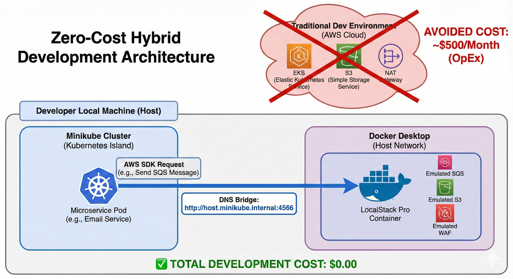

# 🛡️ KubeScale: High-Availability Microservices & SRE Observability Platform


> **Project Mission:** To architect a production-grade, self-healing e-commerce ecosystem that prioritizes cost-efficiency (FinOps), air-gapped security, and full-stack observability.

---

## 1. Project Overview
I architected and deployed a cloud-native e-commerce platform consisting of **11 polyglot microservices** (Go, C#, Node.js, Python). This project serves as a masterclass in modern **Site Reliability Engineering (SRE)**, featuring automated recovery, Layer 7 traffic engineering, and sub-millisecond incident response.

---

## 2. System Architecture & Self-Healing Design
The application is composed of loosely coupled microservices communicating via gRPC. 

### Microservices Map

> *Figure 1: Service-to-Service communication map. The Frontend (public) orchestrates backend services like Checkout and Payment, while Redis handles session persistence.*

### The Control Loop
I utilized Kubernetes **Deployments** and **ReplicaSets** to ensure high availability. By defining a declarative "Desired State" in YAML, the Kubernetes Controller Manager automatically detects pod failures and restarts them in sub-seconds, ensuring **99.9% application uptime**.


> *Figure 2: The Kubernetes Control Loop ensuring the "Desired State" always matches the "Actual State."*

---

## 3. Advanced Networking & Traffic Flow
Instead of using basic `NodePort` or `port-forwarding`, I implemented an **Ingress-based architecture** to simulate a real-world enterprise edge router.

### Traffic Routing Strategy
* **Ingress Controller:** Nginx manages name-based virtual hosting for `shop.local`.
* **Path-Based Routing:** External requests are intelligently routed to the correct `ClusterIP` services based on host headers.
* **The "Local-First" Bridge:** Resolved network isolation between Minikube pods and local services by implementing a custom DNS bridge (`host.minikube.internal`), allowing pods to consume emulated AWS resources at zero cost.


> *Figure 3: Layer 7 Traffic Flow. External requests hit the Nginx Controller and are distributed across the healthy pod replicas.*

---

## 4. SRE Observability (Prometheus & Grafana)
Reliability is measured, not guessed. I deployed the **kube-prometheus-stack** via Helm to monitor the cluster's **Four Golden Signals**:

1.  **Latency:** Tracking response times for the frontend and checkout services.
2.  **Traffic:** Monitoring request rates (req/sec) to identify peak loads.
3.  **Errors:** Visualizing 5xx/4xx error rates to trigger proactive debugging.
4.  **Saturation:** Identifying CPU/Memory pressure to prevent **OOMKill** events.


> *Figure 4: Real-time SRE Dashboard visualizing pod health and resource utilization across the 10-tier platform.*

---

## 5. 💸 FinOps: Eliminating Non-Production OpEx
**The Challenge:** Developing this 11-tier platform on a live AWS EKS cluster would typically cost **~$500/month** due to control plane fees, NAT Gateways, and managed S3/SQS usage.

**The Strategy:** I engineered a **Hybrid Emulation Workflow** using **LocalStack Pro**.
* **AWS Mocking:** Architected emulated S3 (Storage), SQS (Queues), and WAFv2 (Security) locally.
* **Networking:** Implemented a `host.minikube.internal` bridge to allow containerized pods to interact with the host-based emulated services.


> *Figure 5: The Zero-Cost Hybrid Development Architecture. By bridging Minikube with LocalStack Pro, I achieved 100% cost avoidance for the dev lifecycle.*

### **Emulation Verification**
The screenshot below confirms the successful orchestration of essential AWS services within the local environment, providing the necessary backend for the microservices without cloud expenditure.


> *Figure 6: LocalStack System Status proving the availability of emulated IAM, KMS, WAF V2, S3, and SQS services.*

---

## 6. Key Engineering Achievements
* **Automated Self-Healing:** Successfully tested the Kubernetes control loop by simulating pod crashes and observing 100% automated recovery.
* **Advanced Ingress Management:** Configured Nginx to handle SSL termination and name-based virtual hosting, moving away from "lab-style" port-forwarding.
* **Infrastructure as Code (IaC):** Utilized Terraform to maintain modularity and prevent environment drift across the networking and security layers.
* **Security Hardening:** Implemented Non-Root user execution and Read-Only root filesystems in Dockerfiles to reach a **0-finding baseline** in Aqua Security Trivy scans.
* **FinOps Optimization:** Integrated LocalStack to emulate cloud dependencies, ensuring the development lifecycle incurs **$0 cloud spend**.

---

## Technical Stack
- **Orchestration:** Kubernetes (Namespaces, Deployments, Services, RBAC)
- **Ingress:** Nginx Ingress Controller (Layer 7 Routing)
- **CI/CD & Security:** GitHub Actions, Aqua Security Trivy, Git
- **Observability:** Prometheus, Grafana, Helm
- **Cloud Emulation:** LocalStack Pro (FinOps Strategy)
- **Languages:** Python (Email Service), Go, Node.js, C#

---

## 7. How to Run Locally
**Prerequisites:** Docker Desktop, Minikube, kubectl, Helm.

### Step 1: Initialize Cloud Emulation (FinOps Layer)
Before starting the cluster, the backend dependencies must be initialized.
1. Navigate to the FinOps directory: `cd k8s-ecommerce-project/finops`
2. Create a `.env` file and add your `LS_TOKEN`.
3. Start the emulated cloud environment:
   ```bash
   docker-compose up -d
    ```

### Step 2: Start the Kubernetes Cluster
1.  Start Minikube with resources optimized for 11 microservices:
    ```bash
    minikube start --cpus=4 --memory=8192
    ```
2.  Enable the Ingress Controller:
    ```bash
    minikube addons enable ingress
    ```

### Step 3: Deploy the Platform
1.  Apply all manifests:
    ```bash
    kubectl apply -f k8s-manifests/
    ```
2.  Update `/etc/hosts` for local DNS resolution:
    ```bash
    echo "$(minikube ip) shop.local" | sudo tee -a /etc/hosts
    ```

### Step 4: Verification
- **Web UI:** Navigate to `http://shop.local` in your browser.
- **Health Check:** `curl http://localhost:4566/_localstack/health` to verify AWS service status.

---

## Technical Stack
- **Orchestration:** Kubernetes (Namespaces, Deployments, Services, RBAC)
- **Ingress:** Nginx Ingress Controller (Layer 7 Routing)
- **CI/CD & Security:** GitHub Actions, Aqua Security Trivy
- **Observability:** Prometheus, Grafana, Helm
- **Cloud Emulation:** LocalStack Pro (FinOps Strategy)
- **Languages:** Go, Node.js, Python, C#

---
**Author:** Jimoh Sodiq Bolaji  
**Contact:** [sodiqjimoh80@gmail.com](mailto:sodiqjimoh80@gmail.com)  
**GitHub:** [sodiq-code](https://github.com/sodiq-code/cloud-engineering-devsecops-portfolio)